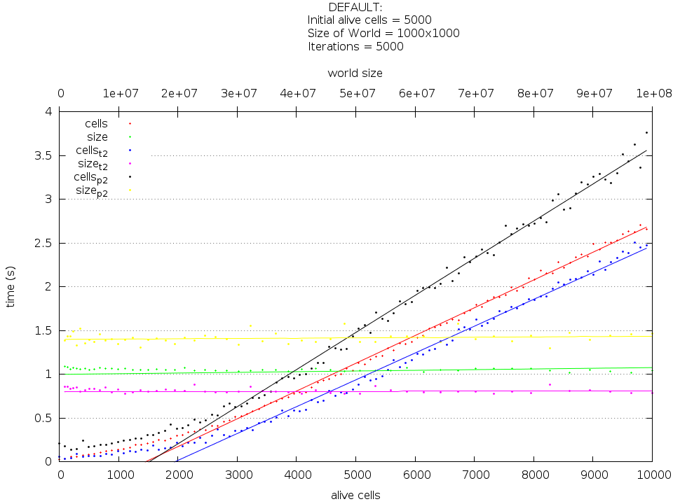
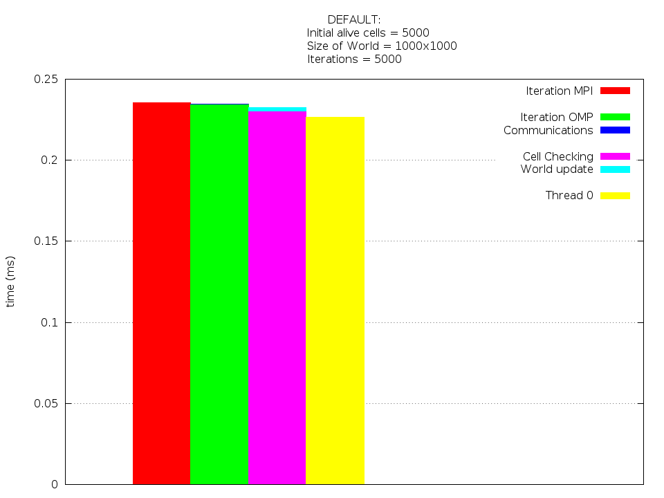
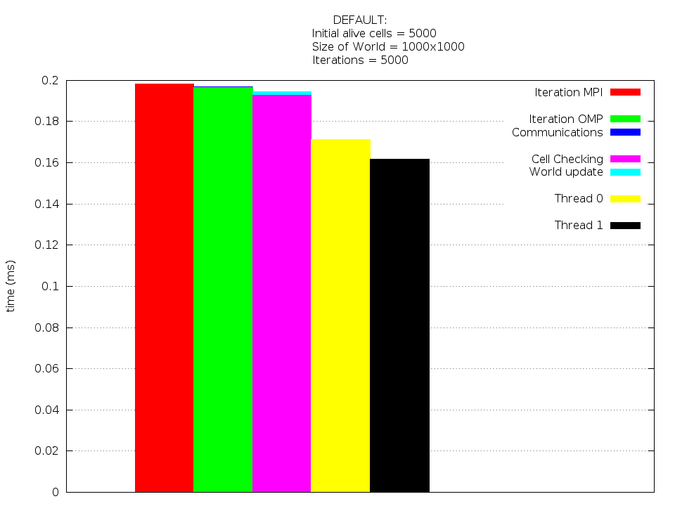
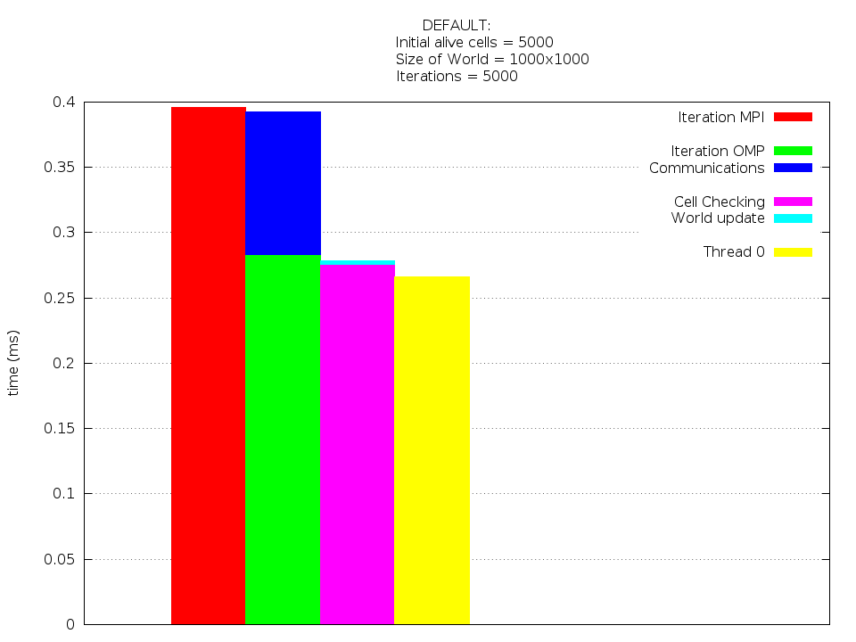

Results
=======

Suffix "*t2*" means two thread, "*p2*" two processes and no suffix means one
thread and one process.

Alive cells and world size VS time
----------------------------------

As we can see the execution with multiple processes have worse result than an
serial execution. 

Iterations VS time
------------------
The algorithm scales linearly.

Profiling
---------
The communication represent a significant proportion of the total iteration
time. And the parallelization with OpenMP have a slight cost too.

